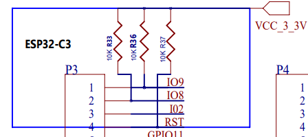

# LilyGO T-PicoC3
Toolset of programs and a UI for the T-PicoC3 running Circuitpython.

## Usecase and Menu

Once we get it working we have pictures and links to the standard libraries and menu software here

## Information

Manufacturer:

- https://www.lilygo.cc/products/lilygo%C2%AE-t-picoc3-esp32-c3-rp2040-1-14-inch-lcd-st7789v
- http://www.lilygo.cn/prod_view.aspx?TypeId=50062&Id=1410&FId=t3:50062:3
- https://github.com/Xinyuan-LilyGO/T-PicoC3

## Pinmap and serial connection rp2040 - esp32c3

### UART on rp2040:

### UART on esp32c3:

Link to schematic: https://github.com/Xinyuan-LilyGO/T-PicoC3/blob/main/Schematic/T-PicoC3.pdf

## Circuitpython Firmware

The regular rp2040 firmware works, but needs a dedicated driver for the display. With the firmware for the T-Display rp2040 the display works, but this firmware currently misses a PID to be published. And the RX, TX, CTS and RTS pins have to be assigned specifically. An independent build for the T-PicoC3 would be beneficial.
